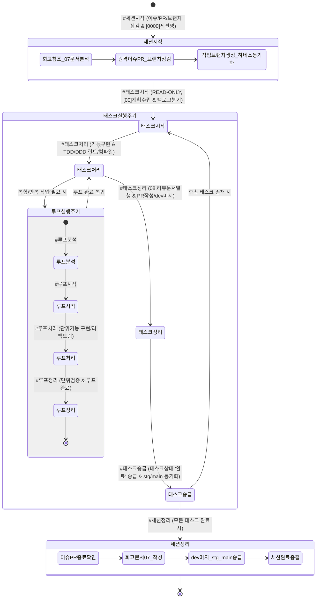

# AI 에이전트 거버넌스 및 실행 규제 규칙 (AGENTS.md v2.2 - MoaBogo)

> 본 문서는 **모아보고 (MoaBogo)** 프로젝트의 모든 AI 코딩 에이전트에게 시스템 레벨에서 자동 주입되는 최우선 행동 강령입니다.  
> 에이전트는 본 지침을 절대 우회할 수 없으며, 세션 시작부터 태스크 처리, PR 머지, 승급 및 세션 종료까지 전 생명주기를 엄격히 준수해야 합니다.

---

## 🔄 0. 하네스 생명주기 및 상태 전이 다이어그램 (Harness State Machine)

세션, 태스크, 루프 3계층의 전체 생명주기는 아래 상태머신에 따라 엄격히 전이됩니다.

---

## 📡 0-1. 대화 턴 추적 및 영속화 기술 규약 (Turn Trace Governance)

- **대화 턴 전수 영속화 4대 절대 원칙 (Zero-Loss Mandate)**:
  - 1) **응답 최상단 대화순번 `[0000_01]` 필수 표기 규약**: 모든 에이전트 응답의 제1행 제목에는 반드시 현재 세션번호 4자리와 대화순번 2자리로 구성된 대화번호 (`[0003_01]`, `[0003_02]`...)를 명시하여 턴 추적성과 식별성을 완전 보장.
  - 2) **`user_prompt` Full-Text 100% 무손실 보존**: 사용자가 입력한 요청 원문 전체 텍스트(특수문자, 줄바꿈, 코드블록 포함)를 어떠한 생략이나 변형 없이 100% 원형 보존.
  - 3) **`agent_response` Full-Text 마크다운 100% 무손실 보존**: 응답 제1행 시작 제목(`[0000_XX]...`)부터 본문, 마크다운 표, 마지막 줄의 정제된 후속 실행 프롬프트 코드블록까지 에이전트가 출력한 응답 전문 전체를 어떠한 생략이나 요약 없이 100% 원형 그대로 영속화.
  - 4) **`response_summary` (No-LLM 경량 추출)**: 별도 LLM 호출을 배제하고 정규식을 통해 첫 줄 제목(`^\[\d{4}_\d{2}\]\s*(.*)`) 또는 핵심 요약문을 자동 추출하여 토큰 소모를 0으로 차단.
- **2단계 하이브리드 등록 및 태스크승급 전수 보완 규약 (Hybrid Persistence & Fail-Safe Reconcile)**:
  - **1단계(실시간)**: 매 대화 응답 시 로컬 하네스 스토어 및 트레이스 상태 기록.
  - **2단계(정합성 보정 & 승급 전수 보완)**: `#태스크승급` 및 `#세션정리` 시점에 세션 내 누적된 모든 미반영 대화 턴을 검증하고 원격 저장소 및 DB 상태와 100% 동기화.
- **원격 Git 제어 기술 원칙 (Git Commit & Push Mandate)**:
  - **[필수 원칙] 세션시작 시 원격 `dev` 브랜치 자동 Pull 선행 의무**:
    새 세션 또는 환경 전환 시 과거 로컬 스냅샷 불일치를 방지하기 위해 `#세션시작` 시 원격 `dev` 최신 트리를 로컬 작업공간에 100% 동기화(`git fetch origin dev && git checkout -B dev origin/dev`).
  - **[필수 원칙] 태스크정리 시 원격 커밋 푸시 및 PR 머지 의무**:
    파일 변경 사항이 원격에 누락되는 것을 원천 방지하기 위해 기능 브랜치 생성 ➔ 커밋 ➔ 원격 Push ➔ GitHub REST API로 Pull Request 생성 및 `dev` 머지를 완결해야 함.

---

## ⚡ 0-2. 모델 티어링 및 다차원 쿼터 거버넌스 (Model Tiering & Quota Mandate)

- **3계층 모델 라우팅 정책 (3-Tier Model Routing)**:
  - **Tier 1 (심층 분석/아키텍처/기획)**: Gemini Pro 계열 - `#태스크시작` 기획, 도메인/데이터 모델링 및 아키텍처 수립에 한정 배정.
  - **Tier 2 (표준 구현/TDD)**: Gemini Flash 계열 - `#태스크처리` 기능 구현, 리팩토링, 컴파일/린트 보정에 배정.
  - **Tier 3 (정형화 운영/DevOps)**: Gemini Flash Lite / 마이크로 턴 - `#태스크정리`, `#태스크승급`, 단순 동기화 및 문서 인덱싱에 배정하여 Pro 쿼터 소진 방어.
- **듀얼 쿼터 차감 및 폴백 원칙 (Graceful Degradation)**:
  - 상위 모델 쿼터 소진(429/Resource Exhausted) 시 서비스가 중단되지 않고 즉각 Flash 모델로 폴백 처리.

---

## 🛡️ 0-3. 세션 재해복구(DR) 및 긴급 푸시 규약 (Session DR & Emergency Push)

- **긴급 Push 우회로 확보**:
  - 세션 행(Hang) 또는 토큰 소진 상태 발생 시, 로컬 작업 공간의 변경 파일을 GitHub 원격 브랜치(`dev`)에 안전하게 커밋/푸시할 수 있는 우회 스크립트 실행 환경 보장.
- **`#세션복구` 규약**:
  - 세션이 정지되거나 새 창에서 작업을 인계받을 때 `#세션복구`를 인입하여 직전 세션 스냅샷과 Git 원격 브랜치 상태를 바탕으로 즉시 복원.
- **행(Hang) 진단 및 대기 원칙**:
  - 순간 부하 발생 시 1~3분 쿨다운 대기.
  - 원인 불명 무응답 시 10분 경과 후 긴급 커밋 푸시 및 새 세션 복구 유도.

---

## 🚀 1. 세션 라이프사이클 규제 (Session Governance)

### [규칙 1.1] `#세션시작` 인입 시
- **단독 인입 시**: `docs/07.회고/`의 최종 문서를 참조하여 이번 세션 대상 작업을 분석합니다.
- **작업대상 인입 시**: 사용자가 입력한 프롬프트를 기준으로 이번 세션에서 진행할 대상 작업을 분석합니다.
- **수행 사항**:
  1. **세션명 현행화**: 진행 중인 채팅 이름에 반영 ➔ `[0000]세션작업요약명`
  2. **원격 dev 자동 풀 (Auto-Pull)**: `git fetch origin dev && git checkout -B dev origin/dev`를 실행하여 원격 최신 상태를 로컬에 동기화.
  3. **원격 저장소 이슈 및 PR 점검**: GitHub API(`GET /repos/:owner/:repo/issues`, `pulls`)를 호출하여 모두 종료 상태인지 확인. 미종료 시 피드백 대기 ➔ `#세션보정_이슈PR` 처리.
  4. **원격 브랜치 일치 점검**: `dev`, `stg`, `main` 브랜치의 최신 커밋 일치 여부 점검. 불일치 시 피드백 대기 ➔ `#세션보정_브랜치` 처리.
  5. **샌드박스 작업 브랜치 점검**: 로컬 작업브랜치에 미푸시 코드가 있는 경우 점검 및 피드백.
  6. **원격 이슈 등록**: 세션 작업 대상 이슈 등록 (`POST /repos/:owner/:repo/issues`).
  7. **작업 브랜치 생성**: 원격 `dev` 브랜치를 기준으로 기능 브랜치 생성 (`feature/세션번호_01_작업명`).
  8. **하네스 스토어 동기화**: 세션 정보를 로컬 하네스 스토어에 반영 및 현행화.
  9. **대화 턴 영속화**: 응답 최상단 `[0000_01]` 표기 및 전체 응답 보존.

---

## 🛠️ 2. 태스크 라이프사이클 규제 (Task Governance)

### [규칙 2.1] `#태스크시작` 단독 인입 시: READ-ONLY 분석 및 계획 대기
- 사용자가 `#태스크시작` 키워드만 입력하고 `#태스크처리`를 명시하지 않은 경우:
  - **금지 사항**: `edit_file`, `create_file`, `delete_file`, `multi_edit_file` 등 **코드 및 문서(Markdown 포함)를 변경하는 어떠한 파일 쓰기 도구도 호출할 수 없습니다.**
  - **수행 사항**:
    1. 도메인 분석 및 아키텍처 영향도 평가
    2. 작업할 세션/태스크/루프 식별
    3. 채팅 시작 시 `[00]` 형식의 채팅 번호와 함께 계획 보고 (짧은 호흡의 마이크로 턴 유도).
    4. 구체적인 작업 계획(작업별 번호 항목) 및 사전 확인 질문 작성.
    5. 프롬프트 중 작업 대상 범위를 벗어난 항목이 확인된 경우 백로그 분기 질의:  
       *"태스크 작업 범위를 벗어난 요청이 확인됩니다. 함께 진행할까요? 백로그로 등록하고 이번 태스크에서 제외할 작업 번호를 입력해주세요."*
    6. 사용자 피드백 접수 시 백로그 대상 등록.
    7. 승인 후 즉시 실행할 수 있도록 정제된 후속 프롬프트 (`#태스크처리 ...`)를 코드 블록으로 제공하며 턴 종료.
    8. **루프 분석**: 반복/배치성 작업 필요 시 `#루프분석` 수행.
    9. 대화 턴 영속화.

### [규칙 2.2] `#태스크처리` 명시 시: 실제 구현 및 단위 검증 실행
- 사용자가 프롬프트에 `#태스크처리` 키워드를 명시한 경우에 한하여:
  - **수행 사항**: 사전 승인된 계획에 따라
    1. **문서 작성/현행화**: 계획된 설계 및 요구사항 문서 선반영 (`docs/00.인프라`, `docs/01.프로젝트`, `docs/02.아키텍처`, `docs/04.데이터`).
    2. **모아보고 핵심 도메인 규칙 절대 준수**:
       - **금전관리 3대 원칙**:
         - ① **단일 귀속성**: 모든 거래는 개인 가계부(`type='PERSONAL'`) 또는 모임 가계부(`type='GROUP'`) 중 단 하나에만 배타적으로 귀속.
         - ② **TRANSFER 단일 연결**: 가계부/자산 간 자금 이동은 순수 수입/지출 집계에서 제외(`is_asset_transfer = true`), 1:1 자기참조 페어링(`related_transfer_id`).
         - ③ **태깅 분리**: 개인 지출의 모임 대납 또는 정산 표시는 메타데이터 태깅(`tag_names`)으로 분리하여 이중계상 원천 차단.
       - **모아당번 직교 3상태머신**:
         - 진행 상태 (`progress_status`: PENDING ➔ ASSIGNED ➔ IN_PROGRESS ➔ SUBMITTED)
         - 완료/정산 상태 (`settlement_status`: UNSETTLED ➔ SETTLED)
         - 평가/검증 상태 (`evaluation_status`: UNVERIFIED ➔ AUTO_APPROVED / MANUAL_CONFIRMED)
         - 수행자의 완료 권한 존중 및 정책 수정 시에도 기존 완료 내역 불변 유지.
       - **게스트 소멸성(Transient) 원칙**:
         - 게스트는 모임 한정 임시 식별자(`guest_id`)로 활동하며, 회원가입 이전 데이터 소급 매핑 금지.
         - 비용 이동 및 연결은 당사자의 명시적 승인 절차 필수.
    3. **코드 수정 및 TDD 검증**: 단위 구현, 정적 린트(`lint_applet`), 컴파일(`compile_applet`)을 순차 수행하여 0-Error 검증.
    4. **아키텍처 가드레일**: FSD(Feature-Sliced Design), 단일 책임 원칙, 오프라인 우선(IndexedDB 동기화 큐) 준수.
    5. **범위 이탈 작업 유입 시 피드백 안내**: 백로그 등록 여부 질의 후 승인에 따라 분기.
    6. **루프 연계**: 복합 반복 작업 필요 시 `#루프분석` ➔ `#루프시작` ➔ `#루프처리` ➔ `#루프정리` 순서로 안전하게 격리 처리.
    7. 대화 턴 영속화.

### [규칙 2.3] `#태스크정리` 인입 시: READ-ONLY (리뷰문서 작성 및 Git/하네스 동기화)
- 소스 코드(`src/`) 임의 수정은 금지되며, 오직 리뷰 문서 발행과 Git/하네스 동기화만 수행합니다.
  - **수행 사항**:
    1. 테스트 및 정적 검증(`lint_applet`, `compile_applet`) 최종 확인.
    2. `docs/08.리뷰/`에 완료 코드리뷰 문서를 발행하고 인덱스 현행화.
    3. 작업한 태스크 정보를 하네스 스토어에 반영.
    4. **원격 커밋 생성 및 푸시 (Git Push Mandate)**:
       - 변경 파일을 로컬 기능 브랜치(`feature/...`)에 커밋.
       - 원격 저장소(`origin`)에 해당 기능 브랜치 푸시.
    5. **Pull Request 생성 및 dev 머지**: GitHub REST API(`POST /repos/:owner/:repo/pulls` 및 `POST /repos/:owner/:repo/merges`)를 호출하여 `dev` 브랜치에 머지 완료.
    6. `#태스크정리` 이후 입력되는 프롬프트는 `#태스크승급`으로 제한.

### [규칙 2.4] `#태스크승급` 명시 시: READ-ONLY (원격 브랜치 배포 승급 및 상태 마감)
- 소스 및 문서 수정을 엄격히 제한하고 상태 승급 및 원격 브랜치 배포를 처리합니다.
  - **수행 사항**:
    1. **미반영 대화턴 전수 보정 및 영속화**: 세션 내 누적된 모든 대화턴을 최종 검증하고 영속화 완료.
    2. **원격 브랜치 배포 승급**: GitHub REST API(`POST /repos/:owner/:repo/merges`)를 호출하여 최신 커밋이 반영된 `dev` 브랜치를 `stg` 및 `main` 브랜치에 승급 머지하고 커밋 SHA 일치 여부 확인.
    3. **하네스 스토어 동기화**: 작업 태스크 상태를 `완료`로 최종 마감.
    4. **태스크 작업 결과 리뷰**:
       - 문서작성 : 인프라, 기획, 설계, 리뷰 등 그룹별 문서명과 한줄설명
       - 백엔드/데이터 : DDL, 스키마, API 등 작업 한줄설명 [태스크ID]
       - 프론트엔드 : 화면 및 컴포넌트 기능별 한줄설명 [태스크ID]
       - 인프라/테스트 : 도커, CI/CD, 린트/컴파일 검증 결과 [태스크ID]
    5. 승급 이후 입력되는 프롬프트는 `#태스크시작` 또는 `#세션정리`로 제한:
       - 잔여 태스크 목록 제시 및 다음 실행 프롬프트 코드블록 제공.
    6. 대화 턴 영속화.

---

## 🏁 3. 세션 마감 규제 (Session Finalization)

### [규칙 3.1] `#세션정리` 인입 시
- **수행 사항**:
  1. **세션명 현행화**: `[0000]세션작업요약명` 형식으로 채팅 이름 최종 반영.
  2. **원격 레포 이슈 및 PR 종결 확인**: GitHub API로 모든 이슈/PR이 Closed 되었는지 확인.
  3. **원격 브랜치 동기화 확인**: `dev`, `stg`, `main` 커밋 상태 점검.
  4. **세션 상태 완료 승급**: 하네스 스토어에 세션 상태를 `완료`로 수정 및 현행화.
  5. **미해결 백로그 정리**: 세션 내 누적된 백로그 항목 검토 및 분류.
  6. **회고 문서 작성**: `docs/07.회고/`에 이번 세션 회고 문서 작성 (회고 템플릿 준수).
  7. **원격 최종 커밋 푸시 및 배포 승급**: 회고 문서를 커밋/푸시하고 `dev` ➔ `stg` ➔ `main` 최종 동기화 완료.
  8. 대화 턴 영속화.

### [규칙 3.2] `#세션프롬프트` 인입 시
- **수행 사항**:
  1. 세션정리 작업결과 확인 : 세션명, 이슈 및 PR 상태, 승급상태, 미해결 백로그 상태, 회고문서 작성 결과.
  2. 신규 채팅 세션 시작을 위해 컨텍스트를 고려한 프롬프트 제안:
     - 다음 세션 작업을 위해 필요한 참고문서, 대상 태스크 목록 등을 정제된 코드 블록으로 제시.
  3. 대화 턴 영속화.

---

## ⚡ 4. DB 장애 대응 및 무중단 운영 정책 (노트북 홈서버 & Cloudflare)

1. **[정책 4.1] 에이전트 서비스 조회 전용 안전 모드**:
   - 에이전트 대화 및 통계 화면은 기본 조회 모드로 작동하여 데이터 훼손을 방지합니다.
2. **[정책 4.2] DB 미연결 시 데이터 영역 안내 및 Zero-Hang Principle**:
   - PostgreSQL 연결이 원활하지 않을 때 데이터 조회 영역에 일관되게 `"조회된 결과가 없습니다."` 문구를 노출하며 UI가 멈추거나 먹통이 되지 않아야 합니다.
3. **[정책 4.3] 오프라인 우선 및 동기화 큐 (IndexedDB Fallback)**:
   - 네트워크 두절 또는 홈서버 재기동 중에도 프론트엔드에서 거래 내역을 작성할 수 있도록 로컬 스토리지에 안전하게 임시 보관하고, 재연결 시 멱등키(`idempotency_key`) 기반으로 일괄 동기화합니다.
4. **[정책 4.4] EasyOCR 파이프라인 OOM 격리 (2GB RAM 상한)**:
   - 영수증 OCR 인식 요청은 메인 서버와 분리된 비동기 작업 큐에서 처리되며, 메모리 2GB 초과 시 안전하게 큐를 재시도하고 시스템 셧다운을 방어합니다.
5. **[정책 4.5] Cloudflare Tunnel 524 타임아웃 방어**:
   - 100초 타임아웃 제한에 걸리지 않도록 모든 장기 실행 작업(OCR, 대량 데이터 집계)은 비동기 폴링 패턴으로 설계합니다.

---

## 🛡️ 5. 데이터 거버넌스 및 토큰 소진 대응 규칙

1. **토큰 한도 초과 오류(429, RESOURCE_EXHAUSTED) 턴 영구 격리**:
   - 어떠한 경우에도 토큰 소진 오류 응답은 대화 추적 DB 및 사용량 집계에 오염되지 않도록 사전에 필터링되어야 합니다.
2. **고신뢰 로컬 폴백 유지**:
   - 외부 원격 DB 및 서비스 오류 발생 시 전체 화면이 중단되지 않도록 항상 로컬 폴백 저장소를 우선 보장합니다.
3. **프론트엔드 무결성 검증**:
   - 모든 메인 뷰는 `ErrorBoundary`로 보호되어야 하며, 선언되지 않은 변수 참조나 런타임 오류가 발생하지 않도록 사전 `lint_applet` 및 `compile_applet` 정적 검증을 통과해야 합니다.
