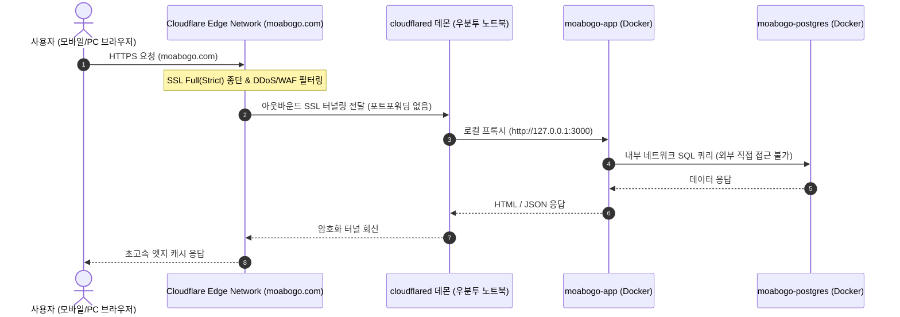

# 모아보고 (MoaBogo) Cloudflare 네트워크 & 터널 보안정책

- **문서 ID**: `000301` (`docs/00.인프라/03.Cloudflare/01.Cloudflare정책.md`)
- **버전**: v1.0
- **최종 수정일**: 2026-10-07
- **공식 도메인**: `moabogo.com`

---

## 📌 1. 개요 및 정책 목표
본 문서는 우분투 노트북 서버의 공인 IP 노출이나 공유기 포트포워딩(80, 443, 5432 포트 오픈) 없이, Cloudflare Tunnel(`cloudflared`)을 통해 안전하게 `moabogo.com` 서비스를 전 세계 사용자에게 HTTPS로 제공하기 위한 네트워크 정책입니다.

### 핵심 원칙
1. **Zero-Port-Forwarding (포트 노출 0개)**: 공유기 및 방화벽에서 인바운드 포트를 단 하나도 열지 않으며, 오직 아웃바운드 암호화 터널로만 트래픽을 중계합니다.
2. **PostgreSQL 포트 외부 완전 차단**: DB(5432) 포트는 로컬 도커 내부망에만 바인딩되어 외부 해킹 시도를 원천 차단합니다.
3. **Cloudflare 524 Timeout 방어**: Cloudflare의 100초 HTTP 타임아웃을 방어하기 위해 OCR 등 무거운 작업은 즉시 `task_id`를 반환하는 비동기 폴링 큐 방식을 적용합니다.

---

## 📂 2. Cloudflare Tunnel 아키텍처 토폴로지


*다이어그램 설명: 브라우저는 Cloudflare 엣지로만 통신하며, 우분투 노트북의 `cloudflared`가 외부로 연결해둔 보안 터널을 통해 로컬 앱으로 프록시합니다. 외부에서는 우분투 노트북의 실제 공인 IP를 전혀 알 수 없습니다.*

---

## 🌐 3. 도메인 및 라우팅 규칙 (`config.yml`)

Cloudflare Zero Trust 대시보드 및 로컬 터널 설정 표준:

```yaml
tunnel: moabogo-laptop-tunnel
credentials-file: /etc/cloudflared/credentials.json

ingress:
  # 1. 메인 웹 서비스 및 REST API
  - hostname: moabogo.com
    service: http://localhost:3000
    originRequest:
      noTLSVerify: false
      connectTimeout: 30s

  # 2. 서브도메인 (개발/스테이징 환경 필요 시)
  - hostname: dev.moabogo.com
    service: http://localhost:3000

  # 3. 그 외 매칭되지 않는 모든 요청 차단
  - service: http_status:404
```

---

## 🛡️ 4. 보안 및 WAF 정책

1. **SSL/TLS 암호화 모드**:
   - `Full (Strict)` 강제 적용 (사용자 ➔ Cloudflare 및 Cloudflare ➔ 터널 전 구간 종단간 암호화).
2. **HSTS (HTTP Strict Transport Security)**:
   - Max-Age: 6개월, IncludeSubDomains, Preload 활성화.
3. **비동기 OCR 처리 및 HTTP 524 에러 가드레일**:
   - 영수증 이미지 OCR 처리 시 15~30초 이상 소요될 수 있으므로, 동기식 대기를 금지하고 `POST /api/v1/ocr/upload` 수신 즉시 HTTP 202 `task_id`를 반환한 뒤 클라이언트가 상태를 비동기 폴링하도록 구현합니다.

---

## 5. 작업 이력 (History)

| 작업일자 | 이슈ID | 태스크 | 작업자 | 작업내용 | 사용 AI 모델명 | 에이전트 | 참고링크 |
| :---: | :---: | :---: | :---: | :--- | :---: | :---: | :---: |
| 2026-10-07 | 0002 | INFRA-CF | AI Studio Agent | Cloudflare Tunnel 기반 무포트포워딩 네트워크 아키텍처 및 보안 정책 수립 | models/gemini-3.8-flash | AI Studio | docs/README-docs.md |
