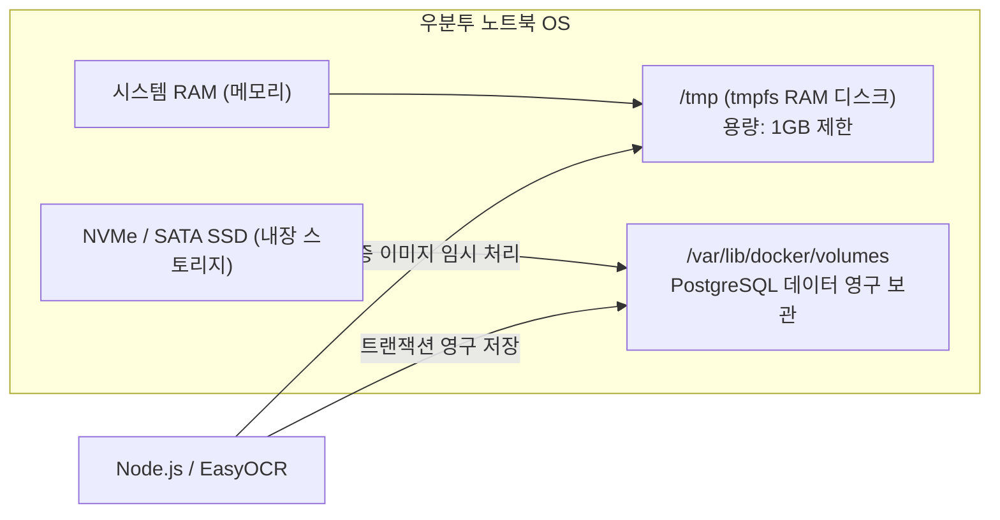

# 모아보고 (MoaBogo) Ubuntu 노트북 서버 운영정책

- **문서 ID**: `000401` (`docs/00.인프라/04.Ubuntu/01.Ubuntu정책.md`)
- **버전**: v1.0
- **최종 수정일**: 2026-10-07
- **대상 하드웨어**: Ubuntu 22.04 / 24.04 LTS Laptop Server

---

## 📌 1. 개요 및 운영 목표
본 문서는 상용 랙 마운트 서버가 아닌 **일반 노트북(Laptop)을 24/7 무중단 홈/사무실 서버 노드로 운용**하기 위해 필수적인 우분투 운영체제 커널, 전원, 스토리지 및 데몬 관리 정책을 규정합니다.

### 핵심 원칙
1. **무중단 지속성 (No-Sleep Guarantee)**: 노트북 덮개를 닫거나 유휴 상태가 되어도 절대로 절전/수면 모드에 진입하지 않아야 합니다.
2. **SSD 수명 보호 (tmpfs RAM Disk)**: OCR 영수증 이미지 등 빈번한 임시 파일 생성/삭제 I/O를 RAM 디스크로 격리하여 노트북 내장 SSD 마모를 방지합니다.
3. **정전 후 자동 복구 (Auto Power-On)**: 전원 차단 후 AC 전원이 재인가되면 사람의 개입 없이 스스로 부팅되고 모든 Docker 컨테이너가 복원되어야 합니다.

---

## 💻 2. 노트북 하드웨어 특화 OS 설정 가이드

### 2.1 덮개 닫힘 방지 설정 (`/etc/systemd/logind.conf`)
노트북 덮개를 닫아도 서버 프로세스가 중단되지 않도록 설정합니다:

```ini
# /etc/systemd/logind.conf 수정
[Login]
HandleLidSwitch=ignore
HandleLidSwitchExternalPower=ignore
HandleLidSwitchDocked=ignore
LidSwitchIgnoreInhibited=no
```
*적용 명령어:*
```bash
sudo systemctl restart systemd-logind
```

### 2.2 시스템 절전 및 수면 모드 완전 비활성화 (Sleep Masking)
커널 레벨에서 슬립 모드 타겟을 마스킹하여 예기치 않은 대기 모드 진입을 차단합니다:

```bash
sudo systemctl mask sleep.target suspend.target hibernate.target hybrid-sleep.target
```

---

## 🚀 3. 스토리지 최적화 및 RAM 디스크 (tmpfs)


*다이어그램 설명: 임시 영수증 이미지는 RAM에 상주하는 `tmpfs`(`/tmp`)에서만 처리하고 즉시 소멸시켜 SSD 쓰기 부하를 0으로 만들며, 실제 정산/가계부 데이터만 SSD 영구 볼륨에 안전하게 저장합니다.*

### 3.1 `/etc/fstab` tmpfs 마운트 설정
```text
# SSD 수명 보호 및 초고속 I/O를 위한 RAM 디스크
tmpfs /tmp tmpfs defaults,noatime,mode=1777,size=1024M 0 0
```

---

## 🔋 4. 전원 관리 및 무인 자동 복구 정책

1. **BIOS / UEFI Wake-on-AC (Restore on AC Power Loss)**:
   - 정전 후 전기가 복구되면 노트북 전원 버튼을 누르지 않아도 자동으로 부팅되도록 BIOS 설정에서 `AC Power Recovery: Power On`으로 설정합니다.
2. **배터리 수명 보호 (Threshold Charging)**:
   - 24시간 AC 어댑터가 연결되어 있으므로, 배터리 임신(스웰링) 현상을 방지하기 위해 충전 임계치를 80%로 제한(예: ASUS `charge_control_end_threshold`, ThinkPad `tpacpi-bat`)합니다.
3. **systemd journald 로그 크기 제한 (`/etc/systemd/journald.conf`)**:
   - `SystemMaxUse=500M`을 설정하여 로그 파일로 인한 디스크 풀(Disk Full) 장애를 사전에 방지합니다.

---

## 5. 작업 이력 (History)

| 작업일자 | 이슈ID | 태스크 | 작업자 | 작업내용 | 사용 AI 모델명 | 에이전트 | 참고링크 |
| :---: | :---: | :---: | :---: | :--- | :---: | :---: | :---: |
| 2026-10-07 | 0002 | INFRA-UBUNTU | AI Studio Agent | 우분투 노트북 단일 노드 24/7 무중단 운영을 위한 OS/하드웨어/스토리지 정책 수립 | models/gemini-3.8-flash | AI Studio | docs/README-docs.md |
