# 모아보고 (MoaBogo) PostgreSQL 데이터베이스 운영정책

- **문서 ID**: `000501` (`docs/00.인프라/05.PostgreSQL/01.PostgreSQL정책.md`)
- **버전**: v1.0
- **최종 수정일**: 2026-10-07
- **엔진 버전**: PostgreSQL 16 (Alpine Docker Container)

---

## 📌 1. 개요 및 운영 목표
본 문서는 우분투 노트북 단일 노드 환경에서 동작하는 PostgreSQL 16 컨테이너의 메모리 및 커넥션 자원을 최적화하고, 외부 해킹 시도로부터 데이터를 보호하며, 무결성과 백업을 보장하기 위한 데이터베이스 운영 정책입니다.

### 핵심 원칙
1. **외부 네트워크 원천 격리**: `0.0.0.0:5432` 포트 바인딩을 금지하며, 오직 Docker 내부 브릿지 네트워크(`moabogo-net`) 내 애플리케이션만 DB에 접속할 수 있습니다.
2. **단일 노드 맞춤형 커넥션 제한**: 노트북 사양을 고려하여 `max_connections`를 30으로 제한하고, 애플리케이션의 커넥션 풀(HikariCP)을 엄격히 통제합니다.
3. **7대 필수 감사 컬럼 의무화**: 모든 테이블은 데이터 추적 및 낙관적 락을 위한 7대 감사 필드를 반드시 유지합니다.

---

## 🗄️ 2. 데이터베이스 구조 및 스키마 분리

```mermaid
graph TD
    subgraph PostgreSQL["PostgreSQL 16 인스턴스 (moabogo-postgres)"]
        subgraph DevDB["개발 데이터베이스 (moabogo_dev)"]
            AI_SCHEMA["전용 스키마: aiagent<br/>(11개 정규 도메인 테이블)"]
            PUBLIC_SCHEMA["public 스키마 (미사용/접근차단)"]
        end
    end
    
    APP["moabogo-app<br/>(Drizzle / TypeORM)"] -->|search_path=aiagent| AI_SCHEMA
```


*다이어그램 설명: 기본 `public` 스키마 대신 격리된 `aiagent` 스키마를 전용으로 생성하여 도메인 테이블을 관리하며, 애플리케이션 접속 시 `search_path`를 명시하여 스키마 오염을 방지합니다.*

---

## ⚙️ 3. 커널 및 DB 리소스 파라미터 튜닝 (`postgresql.conf`)

노트북 환경(RAM 8GB~16GB 기준)에 최적화된 리소스 파라미터:

| 설정 항목 | 권장 값 | 설정 사유 |
| :--- | :--- | :--- |
| `max_connections` | `30` | 커넥션 과다로 인한 메모리 고갈 방지 |
| `shared_buffers` | `256MB` | 시스템 RAM의 약 25% 미만 유지 (노트북 부담 경감) |
| `work_mem` | `16MB` | 정산/통계 정렬 연산 시 메모리 버퍼 |
| `maintenance_work_mem` | `64MB` | 인덱스 생성 및 VACUUM 작업 버퍼 |
| `effective_cache_size` | `1GB` | OS 캐시 고려한 쿼리 플래너 최적화 |
| `wal_buffers` | `16MB` | 트랜잭션 WAL 버퍼 안정화 |

---

## 🛡️ 4. 7대 필수 감사 컬럼(Audit Columns) 규약

`01.데이터설계.md` 및 `02-erd-schema.sql`에 따라 모든 테이블은 아래 7대 감사 컬럼을 반드시 보유해야 하며, 애플리케이션 엔티티 매퍼에서 자동 주입합니다:

1. `created_sys` (VARCHAR(50), NOT NULL, 기본값 `'WEB_APP'`)
2. `created_at` (TIMESTAMPTZ, NOT NULL, 기본값 `CURRENT_TIMESTAMP`)
3. `created_by` (VARCHAR(100), NOT NULL, 기본값 `'SYSTEM'`)
4. `updated_sys` (VARCHAR(50), NOT NULL, 기본값 `'WEB_APP'`)
5. `updated_at` (TIMESTAMPTZ, NOT NULL, 기본값 `CURRENT_TIMESTAMP`)
6. `updated_by` (VARCHAR(100), NOT NULL, 기본값 `'SYSTEM'`)
7. `version` (INT, NOT NULL, 기본값 `1` - 낙관적 동시성 제어)

---

## 💾 5. 백업 및 로테이션 정책

1. **일일 정기 덤프 스크립트 (`cron`)**:
   - 매일 새벽 04:00에 `pg_dump`를 실행하여 압축 덤프 파일(`.sql.gz`) 생성:
     ```bash
     docker exec moabogo-postgres pg_dump -U moabogo_admin -d moabogo_dev -n aiagent | gzip > /backup/moabogo_$(date +%Y%m%d).sql.gz
     ```
2. **로테이션 주기**: 최근 7일간의 백업본을 보관하고 7일 경과 파일은 자동 삭제합니다.

---

## 6. 작업 이력 (History)

| 작업일자 | 이슈ID | 태스크 | 작업자 | 작업내용 | 사용 AI 모델명 | 에이전트 | 참고링크 |
| :---: | :---: | :---: | :---: | :--- | :---: | :---: | :---: |
| 2026-10-07 | 0002 | INFRA-PG | AI Studio Agent | 우분투 노트북 단일 노드 PostgreSQL 16 리소스 튜닝, 스키마 분리 및 백업 정책 수립 | models/gemini-3.8-flash | AI Studio | docs/README-docs.md |
