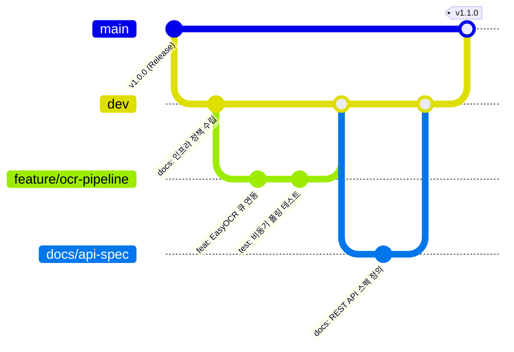

# 모아보고 (MoaBogo) Git 형상관리 및 브랜치 전략정책

- **문서 ID**: `000601` (`docs/00.인프라/06.Git/01.Git정책.md`)
- **버전**: v1.0
- **최종 수정일**: 2026-10-07
- **원격 저장소**: `github.com/jkoogit/moabogo`

---

## 📌 1. 개요 및 운영 원칙
본 문서는 AI 바이브 코딩(Google AI Studio, Cursor 등) 환경과 엔지니어 간의 원활한 협업을 지원하고, 코드와 문서의 단일 진실 공급원(SSOT) 무결성을 보장하기 위한 Git 형상관리 및 커밋/브랜치 정책을 규정합니다.

### 핵심 원칙
1. **규격화된 브랜치 수명주기**: 무분별한 `main` 직접 수정을 금지하고 `dev` 통합 및 목적별 기능/문서 브랜치를 운용합니다.
2. **Conventional Commits 준수**: 커밋 메시지는 기계 가독성과 체계적인 릴리스 노트를 위해 표준 접두어를 사용합니다.
3. **에이전트 지침 (`AGENT.md`) 연동**: AI 에이전트는 사용자의 `#태스크처리` 지시 전 소스를 수정하지 않으며, 작업 완료 시 세션ID+응답순번을 포함하여 보고합니다.

---

## 🌿 2. 브랜치 전략 (Branch Strategy)


*다이어그램 설명: `main` 브랜치는 항상 프로덕션 릴리스가 가능한 클린 상태를 유지하며, 모든 일상 개발 및 설계 문서는 `dev` 브랜치를 기준으로 기능/문서 브랜치(`feature/*`, `docs/*`)로 분기되어 통합됩니다.*

### 2.1 브랜치 분류 및 역할
- **`main`**: 상용 운영 및 Cloudflare를 통해 서비스되는 안정 브랜치 (직접 push 금지, PR/Merge 전용).
- **`dev`**: 개발 통합 및 검증 브랜치.
- **`feature/<기능명>`**: 특정 화면(`SCR-*`) 개발 또는 백엔드 도메인 API 구현 브랜치.
- **`docs/<주제명>`**: 인프라 정책, PRD, API 명세서 등 설계 문서 작성/현행화 브랜치.
- **`hotfix/<이슈명>`**: 긴급 프로덕션 결함 패치 브랜치.

---

## 📝 3. 커밋 메시지 규약 (Conventional Commits)

```text
<타입>: <한 줄 요약 (50자 이내, 한국어 명사형/명령형 종결)>

[본문 (선택 사항 - 변경 이유 및 영향도 기술)]
- 상세 변경점 1
- 상세 변경점 2

[이슈 참조 (선택 사항)]
Resolves: #12
```

### 3.1 커밋 타입 목록
| 타입 | 사용 용도 | 예시 |
| :--- | :--- | :--- |
| **`feat`** | 새로운 기능 또는 화면 추가 | `feat: 빠른 머니등록(SCR-QCK-01) 2단계 OCR 연동` |
| **`fix`** | 버그 및 오작동 수정 | `fix: 다크모드 상단 헤더 컨텐츠 미반전 결함 수정` |
| **`docs`** | 문서 및 DDL 스펙 변경 | `docs: 우분투 노트북 단일 노드 Docker 정책 수립` |
| **`refactor`** | 기능 변경 없는 코드 구조 개선 | `refactor: REST API 통신 클라이언트 모듈 분리` |
| **`test`** | 테스트 코드 작성 및 검증 | `test: 오프라인 멱등성 큐 Stale 충돌 테스트 추가` |
| **`chore`** | 빌드 설정, 의존성 패키지 관리 | `chore: package.json 패키지 업데이트` |

---

## 🛡️ 4. 문서 관리 정책 및 작업 이력 연계 규칙

1. 모든 `docs/` 하위 마크다운 파일 수정 시, 본 문서와 `01.문서관리정책.md`에 명시된 문서 마지막의 작업 이력 표를 반드시 갱신합니다.
2. 커밋 전 `npm run lint` (`tsc --noEmit`) 및 `npm run build`를 수행하여 0-Error 통과를 확인한 후 커밋합니다.

---

## 5. 작업 이력 (History)

| 작업일자 | 이슈ID | 태스크 | 작업자 | 작업내용 | 사용 AI 모델명 | 에이전트 | 참고링크 |
| :---: | :---: | :---: | :---: | :--- | :---: | :---: | :---: |
| 2026-10-07 | 0002 | INFRA-GIT | AI Studio Agent | Git 형상관리, 브랜치 전략, 커밋 메시지 규약 및 에이전트 연동 표준 정책 수립 | models/gemini-3.8-flash | AI Studio | docs/README-docs.md |
