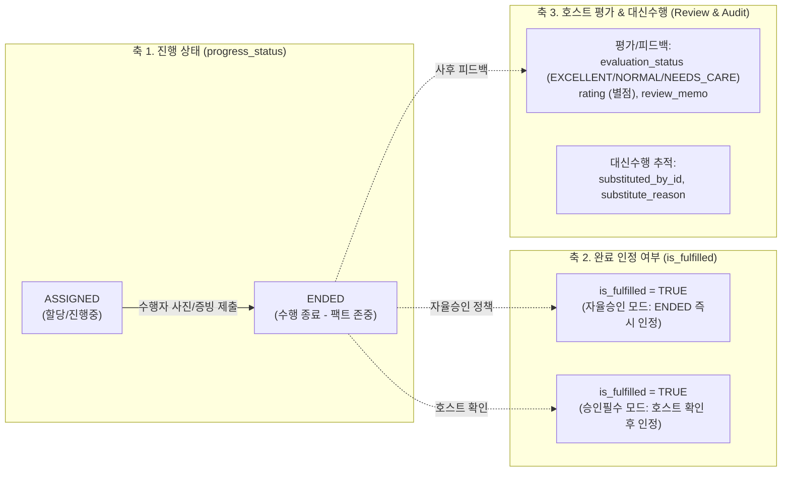
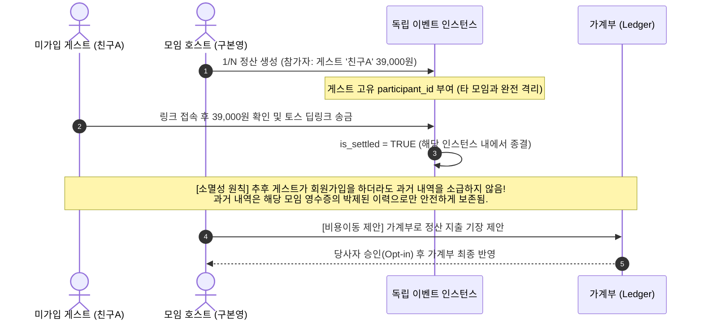
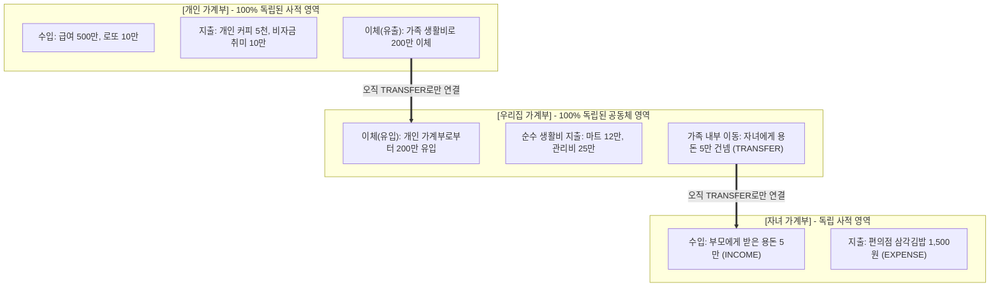

# 모아보고 (MoaBogo) 제품 요구사항 정의서 (PRD)

- **문서 ID**: `010001` (`docs/01.프로젝트/01-prd-spec.md`)
- **버전**: v2.1 (금전관리 3대 원칙, 당번 직교 상태머신, 게스트 소멸성 정책 반영)
- **최종 수정일**: 2026-10-08
- **공식 서비스 도메인**: `moabogo.com`

---

## 📌 1. 서비스 정체성 & 핵심 가치

모아보고(MoaBogo)는 **"1인 다중 가계부"**, **"비로그인 게스트를 포용하는 독립 모임 정산/게임"**, **"생활 밀착형 모아 3대 확장 서비스(당번/용돈/빌림)"**를 결합하여 개인과 공동체의 자산 흐름을 투명하고 유연하게 연결하는 스마트 라이프 플랫폼입니다.

### 3대 핵심 설계 철학
1. **Zero-Onboarding (가입 즉시 완성)**: 회원가입 완료 즉시 기본 개인 가계부가 자동 생성되며, 복잡한 설정 없이 바로 지출을 기록할 수 있습니다.
2. **거래 원자성 및 단일 귀속성 (Single Ledger Ownership)**: 하나의 거래는 오직 하나의 가계부에만 귀속되며, 가계부 간의 복제나 비대한 양방향 분개 없이 오직 명시적 이체(`TRANSFER`)로만 경계를 넘나듭니다.
3. **게스트 소멸성 인스턴스(Ephemeral Instance)**: 모임 정산 및 집안일 당번은 회원 가입 없이도 참여할 수 있으며, 게스트 내역은 복잡한 사후 소급 없이 해당 모임 인스턴스 이력으로 안전하게 완결됩니다.

---

## 👥 2. 사용자 페르소나 및 핵심 시나리오

| 페르소나 | 주요 행동 및 목표 | 시스템 제공 가치 |
| :--- | :--- | :--- |
| **호스트 / 가계 관리자** (부모, 총무, 모임장) | • 가족 가계부와 개인 가계부를 오가며 예산 총괄 • 자녀의 용돈 요청 승인 및 집안일 당번 평가/피드백 • 정산 시 지출 통계 왜곡 없이 자산만 분리 기장 | • 다중 가계부 RBAC 권한 분리 • `is_asset_transfer` 회계 가드레일 • 당번 직교 완료/평가 분리 관리 |
| **구성원 / 피지급자** (자녀, 동창, 파트너) | • 영수증 사진을 찍어 1초 만에 지출 등록 • 용돈 긴급 청구 및 당번 수행 인증샷 제출 • 카톡/토스 딥링크로 3초 만에 회비 송금 | • 2단계 OCR 자동 파싱 • 3대 빅테크 딥링크 3초 이체 • 당번 수행종료(`ENDED`) 팩트 존중 |
| **비회원 게스트** (일회성 모임 동행자) | • 앱 설치나 가입 없이 1/N 정산 링크 수신 • 내 몫의 금액만 확인 후 토스로 즉시 송금 • 모임 종료 후 개인정보/소급 부담 없이 깔끔한 종료 | • 비로그인 게스트 1회성 참여 허용 • 소멸성 인스턴스 데이터 격리 |

---

## ⚙️ 3. 핵심 유스케이스 (Use Cases) 상세 명세

### UC-01: 1인 다중 가계부 스위칭 및 독립 장부 운영
- **주요 액터**: 회원 (Owner, Member, Viewer)
- **기본 흐름**:
  1. 시스템은 사용자가 소유하거나 참여 중인 가계부 목록을 조회합니다 (`PERSONAL`, `GROUP`).
  2. 사용자는 상단 칩을 클릭하여 가계부 컨텍스트를 즉시 전환합니다.
  3. 모든 지출/수입 등록은 현재 선택된 단 하나의 가계부에만 100% 원자적으로 저장되며, 타 가계부로 자동 복제되지 않습니다.

### UC-02: 2단계 OCR 비동기 파싱 및 0원 Fallback 파이프라인
- **주요 액터**: 가계부 구성원
- **기본 흐름**:
  1. 사용자가 영수증 이미지를 캡처/업로드합니다.
  2. 시스템은 이미지 SHA-256 해시를 생성하여 중복 업로드 여부를 검증하고, 백엔드 세마포어 큐에 접수 후 즉시 `task_id`를 반환합니다.
  3. **1차 로컬 처리**: 우분투 Docker EasyOCR이 백그라운드에서 가맹점, 금액, 일자, 품목을 추출합니다.
  4. **2차 Fallback 가드레일**:
     - 가맹점 인식 실패, 금액 0원 등 유효성 검증 실패 시 `flagged_fields`를 지정하고 수동 보정 모달을 호출합니다.
     - 사용자가 자신의 개인 Vision API Key(Google/OpenAI)를 등록한 경우, 개인 키로 2차 정밀 분석을 수행하여 서버 운영비 0원을 유지합니다.
  5. 검증 완료 후 지정 가계부의 `transactions` 테이블로 즉시 기장됩니다.

### UC-03: 독립 모임 정산 (1/N, 게임) 및 딥링크 간편 송금
- **주요 액터**: 모임 주최자 및 참가자 (회원/게스트)
- **기본 흐름**:
  1. 주최자는 가계부 종속 없이 1/N 정산, 사다리타기, 술래잡기를 즉시 실행합니다.
  2. 참석자 목록에서 회원을 선택하거나 미가입 게스트(예: '친구A')를 추가합니다.
  3. 총 정산 금액 입력 시 시스템이 인원수대로 절사 분할 계산합니다.
  4. 결과 화면에서 토스/카카오페이/네이버페이 딥링크 버튼을 제공하여 3초 만에 송금을 완료합니다.
  5. 정산 데이터는 해당 모임 인스턴스 내에서 소멸성으로 보존되며, 타인의 가계부에 강제로 채무를 생성하지 않습니다.

---

## 🔄 4. 모아당번 (MoaDuty) 직교 3축 상태머신 전이 매트릭스

당번 과업의 진행 상태와 승인 여부를 억지로 하나의 컬럼에 합치지 않고, **1) 수행자의 진행상태(Progress)**, **2) 가계부 정책에 따른 완료인정(Fulfillment)**, **3) 호스트 사후 평가(Evaluation)**의 3대 직교(Orthogonal) 축으로 분리하여 설계합니다.

*다이어그램 설명: 수행자가 과업을 마치고 증빙을 제출한 사실(`ENDED`)은 불변으로 존중됩니다. 가계부 설정(자율승인 vs 승인필수)에 따라 `is_fulfilled` 완료 플래그가 매핑되며, 호스트는 수행 상태를 되돌리지 않고 독립된 평가 축(`evaluation`)을 통해 칭찬과 피드백을 기록합니다.*

### 상태머신 전이 매트릭스 (Transition Matrix)

| 구분 | 컬럼 / 속성 | 상태 값 | 액터 | 전이 조건 및 비즈니스 룰 |
| :--- | :--- | :--- | :---: | :--- |
| **진행 상태** | `progress_status` | `ASSIGNED` ➔ `ENDED` | 수행자 | • 사진 URL 또는 수행 메모 제출 필수. • 수행자가 완료 선언한 팩트(Fact)는 호스트가 임의 취소 불가. |
| **완료 인정** | `is_fulfilled` | `FALSE` ➔ `TRUE` | 시스템 또는 호스트 | • **자율승인 모드**: `progress_status == ENDED` 도달 시 시스템이 즉시 `TRUE` 확정. • **승인필수 모드**: 호스트 확인 클릭 시 `TRUE` 확정. • **영구 보존 원칙**: 추후 가계부 정책이 바뀌어도 이미 `TRUE`가 된 과거 완료 내역은 절대 소급 취소되지 않음. |
| **호스트 평가** | `evaluation_status` | `PENDING` ➔ `EXCELLENT` / `NORMAL` / `NEEDS_CARE` | 호스트 | • 과업 종료 후 호스트가 별점(`rating: 1~5`) 및 피드백 메모 등록. • 수행자 포인트 기여도에 반영. |
| **대신수행** | `substituted_by_id` | 회원 UUID | 대신 수행자 | • 원래 배정자(`assigned_user_id`)와 대신 수행자(`substituted_by_id`)를 분리 기록하여 투명성 보장. |

---

## 🔗 5. 게스트(Guest) 소멸성 인스턴스(Ephemeral Instance) 격리 원칙

게스트 활동을 나중에 회원가입할 때 억지로 찾아내어 DB를 대규모 UPDATE하는 복잡한 소급 매핑(Retrospective Mapping)을 완전히 배제하고, **소멸성 인스턴스 격리** 원칙을 확립합니다.

*다이어그램 설명: 게스트 '친구A'의 활동은 해당 모임 인스턴스 안에서만 고유한 `participant_id`로 식별되며, 모임 종료 시 인스턴스 이력으로 완결됩니다. 사후 회원가입 시 복잡한 소급 매핑을 수행하지 않으며, 비용 이동은 당사자의 승인 절차를 통해서만 이루어집니다.*

### 게스트 관리 3대 단순화 규칙
1. **모임 한정 식별자(Participant ID)**: 게스트의 닉네임은 단순 표시용이며, 모임 인스턴스별 고유 ID(`participant_id`)로 독립 식별되어 타 모임과 절대 섞이지 않습니다.
2. **사후 소급 배제(No Retrospective Mapping)**: 게스트가 나중에 모아보고에 회원가입을 하더라도, 과거 게스트 내역을 억지로 찾아 계정에 붙이지 않습니다. 시스템 프로세스 비대화를 원천 차단합니다.
3. **비용 이동 당사자 승인(Opt-in) 필수**: 타인의 가계부에 채무나 비용을 일방적으로 밀어 넣을 수 없으며, 제안 ➔ 수락의 상호 확인 절차가 선행되어야 합니다.

---

## 💰 6. 가계부 활동의 원자성과 금전관리 3대 정책 (Money Management Axioms)

급여, 로또, 비자금, 용돈, 가족 생활비가 뒤엉켜 계산이 폭주하는 현상을 막기 위한 **단순하고 일관된 3대 금전관리 공리(Axioms)**를 규정합니다.

*다이어그램 설명: 개인과 그룹 가계부는 완전히 독립된 원자적 장부이며, 서로의 장부를 침범하지 않습니다. 가계부 간의 연결은 오직 '이체(TRANSFER)'라는 명시적 자금 이동 통로로만 이루어지며, 복잡한 자동 분개나 양방향 복제는 발생하지 않습니다.*

---

### 원칙 1. 단일 거래의 단일 가계부 귀속성 (Single Ledger Ownership)
- 모든 거래는 **오직 하나의 가계부(Primary Ledger)**에만 기록됩니다.
- 한 가계부에서 지출이나 수입을 등록했다고 해서 다른 가계부로 데이터가 복제되거나 미러링되지 않습니다 (원자성 100% 유지).
- **급여, 로또, 비자금**: 오직 `[개인 가계부]`에서만 발생하며, 그룹 가계부는 이 내역의 존재 자체를 알 필요가 없습니다 (완벽한 사생활 보장).
- **가족 공금 마트 장보기**: 오직 `[그룹 가계부]`에만 1건 기록됩니다.

### 원칙 2. 가계부 간의 경계는 오직 '이체(TRANSFER)'로만 연결
- 서로 다른 가계부 간에 자금이 오갈 때는 복잡한 연결회계가 아니라, 일상생활의 '계좌이체'처럼 **이체(`TRANSFER`)**로 단순 처리합니다.
- **용돈 지급 시나리오**:
  1. 부모 그룹 가계부: 5만 원 출금 ➔ `TRANSFER` (가족 내부 자산이동, 소비지출 0원).
  2. 자녀 개인 가계부: 5만 원 입금 ➔ `INCOME` (용돈 수입).
  3. 자녀가 편의점에서 5천 원 결제: 오직 `[자녀 개인 가계부]`에만 지출(`EXPENSE: 5,000`) 1건 기록!
  - 👉 **결과**: 부모 가계부의 생활비는 0원으로 깨끗하고, 자녀의 지출만 자녀 장부에서 정확히 카운트됩니다. 이중 합산 위험 0%.
- **생활비 송금 시나리오**:
  - 남편이 개인 통장에서 200만 원을 보낼 때: 남편 개인 가계부는 200만 원 이체 유출(`TRANSFER`), 가족 가계부는 200만 원 이체 유입(`TRANSFER`).

### 원칙 3. '결제자(Payer)'와 '대상자(Beneficiary)'의 단순 태깅 분리
- 가족 가계부에서 10만 원 마트 장을 아빠 카드로 긁었을 때:
  - 가족 가계부에 지출 10만 원 1건 기록 (`EXPENSE`, 100,000원).
  - 속성 태그만 기록: 결제자(`payer: 아빠`), 사용처(`beneficiary: 가족전체`).
  - 이것을 아빠 개인 가계부로 복제하지 않습니다. 아빠는 가족 가계부에서 "내가 이번 달 가족을 위해 카드로 긁어준 금액" 필터로 확인하면 끝납니다.

### 회계 집계 공식
$$\text{순수 생활비 지출} = \sum \text{amount} \quad (\text{WHERE } \text{transaction\_type} = \text{'EXPENSE'} \land \text{is\_asset\_transfer} = \text{FALSE})$$

$$\text{순수 가계 수입} = \sum \text{amount} \quad (\text{WHERE } \text{transaction\_type} = \text{'INCOME'} \land \text{is\_asset\_transfer} = \text{FALSE})$$

---

## 7. 작업 이력 (History)

| 작업일자 | 이슈ID | 태스크 | 작업자 | 작업내용 | 사용 AI 모델명 | 에이전트 | 참고링크 |
| :---: | :---: | :---: | :---: | :--- | :---: | :---: | :---: |
| 2026-10-07 | 0001 | DOCS-INIT | jkoogit | 초기 제품 요구사항 정의서(PRD) 초안 작성 | - | - | docs/01.프로젝트/ |
| 2026-10-08 | 0002 | PRD-EXPAND | AI Studio Agent | 유스케이스 상세화, 모아당번 상태머신, 게스트 소급 매핑 및 이중계상 방지 규칙 작성 | models/gemini-3.8-flash | AI Studio | docs/README-docs.md |
| 2026-10-08 | 0002 | PRD-V2.1 | AI Studio Agent | 금전관리 3대 원칙(단일 귀속성, TRANSFER 연결, 태깅 분리), 당번 직교 상태머신, 게스트 소멸성 인스턴스 정책 확립 | models/gemini-3.8-flash | AI Studio | docs/01.프로젝트/01-prd-spec.md |
