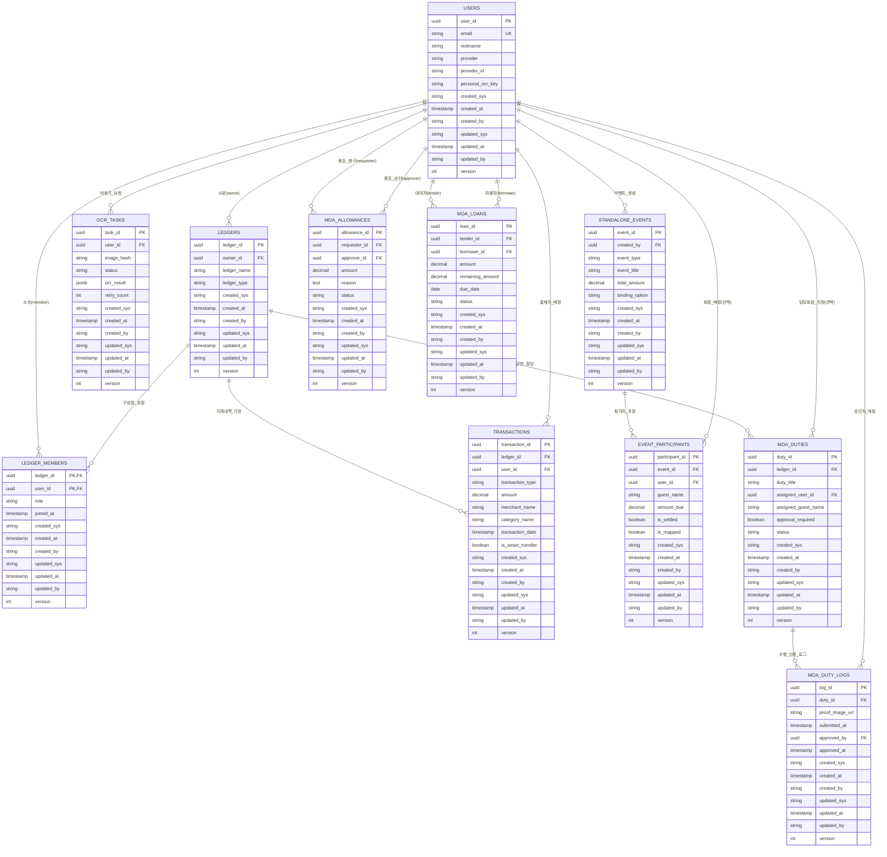

# 모아보고 (MoaBogo) 데이터베이스 및 엔티티 상세설계서

- **문서 ID**: `040001` (`docs/04.데이터/01.데이터설계.md`)
- **버전**: v2.0
- **최종 수정일**: 2026-10-08
- **대상 인프라**: Ubuntu 단일 노드 Docker 컨테이너 (`PostgreSQL 16 Alpine`)
- **전용 스키마**: `aiagent`

---

## 📌 1. 개요 및 설계 원칙

본 문서는 모아보고(MoaBogo)의 1인 다중 가계부, 독립 모임 정산/게임, 모아 3대 확장 라이프(당번/용돈/빌림) 및 2단계 OCR 파이프라인을 지원하는 **11개 정규 도메인 테이블의 논리/물리 데이터 모델링, Mermaid ERD 다이어그램, 테이블 컬럼 정의서 및 데이터 사전**을 규정합니다.

### 핵심 데이터 설계 원칙
1. **소비 지출과 자산/부채 이동의 회계 분리**: `transactions.is_asset_transfer` 플래그를 통해 용돈/빌림/이체 거래가 당월 순수 생활비 예산 통계를 왜곡하지 않도록 데이터 레벨에서 격리합니다.
2. **게스트와 회원의 유연한 포용**: 독립 이벤트 및 모아당번은 정식 가입 회원(`user_id` FK)뿐 아니라 미가입 게스트(`guest_name`)를 수용하며, 회원가입 시 소급 매핑이 가능한 구조로 설계합니다.
3. **7대 필수 감사 컬럼 전수 적용**: 변경 추적성 및 분산 동시성 제어를 위해 전 테이블에 감사 컬럼(`created_sys`, `created_at`, `created_by`, `updated_sys`, `updated_at`, `updated_by`, `version`)을 의무화합니다.
4. **낙관적 락(Optimistic Lock)**: `version` 정수 필드를 통해 오프라인 동기화 시 Stale 충돌을 감지하고 무결성을 방어합니다.

---

## 🗺️ 2. 통합 ERD 다이어그램 (Mermaid)

*다이어그램 설명: 모아보고 핵심 엔티티 관계도입니다. `USERS`는 다중 `LEDGERS`를 소유하거나 `LEDGER_MEMBERS`로 참여하며, 각 가계부마다 `TRANSACTIONS` 및 `MOA_DUTIES`가 종속됩니다. 독립 이벤트(`STANDALONE_EVENTS`) 및 당번은 미가입 게스트를 수용하기 위해 `user_id`를 Nullable로 두고 게스트 식별 컬럼을 병행 지원합니다.*

---

## 📖 3. 데이터 사전 (Data Dictionary)

| 표준 단어 | 논리명 | 물리명 | 데이터 타입 | 설명 / 허용값 |
| :--- | :--- | :--- | :--- | :--- |
| **User ID** | 사용자 식별자 | `user_id` | `UUID` | 시스템 전역 고유 사용자 식별 키 |
| **Ledger ID** | 가계부 식별자 | `ledger_id` | `UUID` | 1인 다중 가계부 고유 키 |
| **Ledger Type** | 가계부 유형 | `ledger_type` | `VARCHAR(20)` | `PERSONAL`(개인), `GROUP`(그룹) |
| **Transaction Type** | 거래 유형 | `transaction_type`| `VARCHAR(20)` | `EXPENSE`(지출), `INCOME`(수입), `TRANSFER`(이체) |
| **Is Asset Transfer**| 자산이동 여부 | `is_asset_transfer`| `BOOLEAN` | `true`: 생활비 예산 왜곡 방지용 자산/부채 이동 |
| **Task Status** | OCR 작업상태 | `status` | `VARCHAR(20)` | `PENDING`, `PROCESSING`, `COMPLETED`, `FAILED`, `STALE` |
| **Binding Option** | 가계부 연동옵션 | `binding_option` | `VARCHAR(20)` | `ASK_AFTER`(선택), `AUTO_LINK`(자동), `SKIP`(생략) |
| **Duty Status** | 당번 수행상태 | `status` | `VARCHAR(20)` | `ASSIGNED`(할당), `ENDED`(수행제출), `COMPLETED`(승인) |
| **Allowance Status**| 용돈 청구상태 | `status` | `VARCHAR(20)` | `REQUESTED`, `APPROVED`, `PAID`, `REJECTED` |
| **Loan Status** | 대여 상환상태 | `status` | `VARCHAR(20)` | `ACTIVE`, `PARTIAL_PAID`, `FULLY_PAID`, `OVERDUE` |

---

## 📋 4. 11개 테이블 상세 컬럼 정의서

### 4.1 `users` (회원 및 인증 계정)
- **설명**: 소셜 로그인 회원 및 2차 개인 Vision API Key 저장

| 컬럼명 | 논리명 | 데이터 타입 | PK/FK | Null | 기본값 | 비고 / 도메인 규칙 |
| :--- | :--- | :--- | :---: | :---: | :--- | :--- |
| `user_id` | 사용자ID | UUID | PK | N | `uuid_generate_v4()` | 고유 UUID |
| `email` | 이메일 | VARCHAR(255) | - | Y | - | 소셜 로그인 연동 이메일 (Unique) |
| `nickname` | 닉네임 | VARCHAR(100) | - | N | - | 화면 표시용 사용자 이름 |
| `provider` | 인증 제공자 | VARCHAR(20) | - | N | - | `KAKAO`, `TOSS`, `NAVER`, `EMAIL` |
| `provider_id` | 제공자 고유ID | VARCHAR(255) | - | Y | - | OAuth 연동 토큰 식별자 |
| `personal_ocr_key`| 개인 OCR Key | VARCHAR(255) | - | Y | - | 사용자 소유 2차 Vision Key (서버비용 0원) |
| `created_sys` ~ `version` | 7대 감사컬럼 | - | - | N | 표준 기본값 | 생성/수정 추적 및 동시성 제어 |

---

### 4.2 `ledgers` (1인 다중 가계부)
- **설명**: 개인 가계부, 가족 그룹 가계부, 인스턴스 모임 가계부 관리

| 컬럼명 | 논리명 | 데이터 타입 | PK/FK | Null | 기본값 | 비고 / 도메인 규칙 |
| :--- | :--- | :--- | :---: | :---: | :--- | :--- |
| `ledger_id` | 가계부ID | UUID | PK | N | `uuid_generate_v4()` | 가계부 고유 식별자 |
| `owner_id` | 소유자ID | UUID | FK | N | - | `users.user_id` 참조 (CASCADE 삭제) |
| `ledger_name` | 가계부 이름 | VARCHAR(100) | - | N | - | 예: '우리집 가계부', '내 개인 가계부' |
| `ledger_type` | 가계부 유형 | VARCHAR(20) | - | N | `'PERSONAL'` | `PERSONAL`, `GROUP` |
| `created_sys` ~ `version` | 7대 감사컬럼 | - | - | N | 표준 기본값 | 생성/수정 추적 및 동시성 제어 |

---

### 4.3 `ledger_members` (가계부 멤버십 및 RBAC)
- **설명**: 가계부별 참여 멤버 및 역할 권한 (`OWNER`, `MEMBER`, `VIEWER`)

| 컬럼명 | 논리명 | 데이터 타입 | PK/FK | Null | 기본값 | 비고 / 도메인 규칙 |
| :--- | :--- | :--- | :---: | :---: | :--- | :--- |
| `ledger_id` | 가계부ID | UUID | PK, FK| N | - | `ledgers.ledger_id` 참조 |
| `user_id` | 사용자ID | UUID | PK, FK| N | - | `users.user_id` 참조 |
| `role` | 멤버 권한 | VARCHAR(20) | - | N | `'MEMBER'` | `OWNER`(방장), `MEMBER`(작성가능), `VIEWER`(조회전용) |
| `joined_at` | 참여 일시 | TIMESTAMPTZ | - | N | `CURRENT_TIMESTAMP` | 가계부 참여 승인 일시 |
| `created_sys` ~ `version` | 7대 감사컬럼 | - | - | N | 표준 기본값 | 생성/수정 추적 및 동시성 제어 |

---

### 4.4 `transactions` (입출금 및 자산이동 내역)
- **설명**: 수입/지출 내역. `is_asset_transfer: true` 설정 시 생활비 통계에서 원천 분리

| 컬럼명 | 논리명 | 데이터 타입 | PK/FK | Null | 기본값 | 비고 / 도메인 규칙 |
| :--- | :--- | :--- | :---: | :---: | :--- | :--- |
| `transaction_id` | 거래내역ID | UUID | PK | N | `uuid_generate_v4()` | 트랜잭션 고유 키 |
| `ledger_id` | 가계부ID | UUID | FK | N | - | `ledgers.ledger_id` 참조 |
| `user_id` | 결제자ID | UUID | FK | Y | - | `users.user_id` 참조 |
| `transaction_type`| 거래 유형 | VARCHAR(20) | - | N | - | `EXPENSE`(지출), `INCOME`(수입), `TRANSFER`(이체) |
| `amount` | 거래 금액 | DECIMAL(12,2)| - | N | - | 금액 (원) |
| `merchant_name` | 가맹점/거래처 | VARCHAR(150) | - | Y | - | 예: '이마트 양재점', '구민우(용돈)' |
| `category_name` | 카테고리 | VARCHAR(50) | - | Y | - | 식료품, 카페, 자산이동 등 |
| `transaction_date`| 결제 일시 | TIMESTAMPTZ | - | N | - | 실제 지출/수입 발생 시각 |
| `is_asset_transfer`| 자산이동 플래그| BOOLEAN | - | N | `FALSE` | `TRUE` 시 생활비 집계 대상에서 제외 (회계 가드레일) |
| `created_sys` ~ `version` | 7대 감사컬럼 | - | - | N | 표준 기본값 | 생성/수정 추적 및 동시성 제어 |

---

### 4.5 `ocr_tasks` (OCR 비동기 처리 큐)
- **설명**: EasyOCR 및 개인 Vision Key를 통한 영수증 비동기 파싱 태스크

| 컬럼명 | 논리명 | 데이터 타입 | PK/FK | Null | 기본값 | 비고 / 도메인 규칙 |
| :--- | :--- | :--- | :---: | :---: | :--- | :--- |
| `task_id` | 작업ID | UUID | PK | N | `uuid_generate_v4()` | 태스크 고유 키 |
| `user_id` | 요청자ID | UUID | FK | N | - | `users.user_id` 참조 |
| `image_hash` | 이미지 해시 | VARCHAR(64) | - | N | - | SHA-256 해시 (동일 이미지 멱등성 보장) |
| `status` | 작업 상태 | VARCHAR(20) | - | N | `'PENDING'` | `PENDING`, `PROCESSING`, `COMPLETED`, `FAILED`, `STALE` |
| `ocr_result` | 파싱 결과 | JSONB | - | Y | - | 가맹점, 금액, 품목 배열, 오인식 플래그 |
| `retry_count` | 재시도 횟수 | INT | - | N | `0` | 최대 3회 초과 시 FAILED 전환 |
| `created_sys` ~ `version` | 7대 감사컬럼 | - | - | N | 표준 기본값 | 생성/수정 추적 및 동시성 제어 |

---

### 4.6 `standalone_events` (독립 이벤트 정산 및 게임)
- **설명**: 1/N 정산, 사다리타기, 술래잡기 등 가계부 종속 없이 즉시 실행되는 이벤트

| 컬럼명 | 논리명 | 데이터 타입 | PK/FK | Null | 기본값 | 비고 / 도메인 규칙 |
| :--- | :--- | :--- | :---: | :---: | :--- | :--- |
| `event_id` | 이벤트ID | UUID | PK | N | `uuid_generate_v4()` | 이벤트 고유 키 |
| `created_by` | 개설자ID | UUID | FK | N | - | `users.user_id` 참조 |
| `event_type` | 이벤트 종류 | VARCHAR(50) | - | N | - | `SETTLEMENT_1_N`, `LADDER`, `TAG` |
| `event_title` | 이벤트 제목 | VARCHAR(150) | - | N | - | 예: '주말 글램핑 바베큐 정산' |
| `total_amount` | 총 정산액 | DECIMAL(12,2)| - | N | `0` | 정산 기준 총액 |
| `binding_option` | 가계부 연동옵션| VARCHAR(20) | - | N | `'ASK_AFTER'` | `ASK_AFTER`(선택), `AUTO_LINK`, `SKIP` |
| `created_sys` ~ `version` | 7대 감사컬럼 | - | - | N | 표준 기본값 | 생성/수정 추적 및 동시성 제어 |

---

### 4.7 `event_participants` (이벤트 참가자 및 게스트)
- **설명**: 이벤트 참가자 목록. 정식 회원 및 미가입 게스트 수용

| 컬럼명 | 논리명 | 데이터 타입 | PK/FK | Null | 기본값 | 비고 / 도메인 규칙 |
| :--- | :--- | :--- | :---: | :---: | :--- | :--- |
| `participant_id` | 참가자ID | UUID | PK | N | `uuid_generate_v4()` | 고유 식별자 |
| `event_id` | 이벤트ID | UUID | FK | N | - | `standalone_events.event_id` 참조 (CASCADE) |
| `user_id` | 정식회원ID | UUID | FK | Y | - | 정식 회원일 경우 매핑 (게스트는 NULL) |
| `guest_name` | 게스트 닉네임 | VARCHAR(100) | - | Y | - | 미가입 게스트 식별용 이름 (예: '친구A') |
| `amount_due` | 분담 청구액 | DECIMAL(12,2)| - | N | `0` | 해당 참가자에게 할당된 1/N 금액 |
| `is_settled` | 정산 완료여부 | BOOLEAN | - | N | `FALSE` | 딥링크 송금 완료 시 TRUE |
| `is_mapped` | 회원 매핑여부 | BOOLEAN | - | N | `FALSE` | 추후 회원가입 시 계정 연동 여부 |
| `created_sys` ~ `version` | 7대 감사컬럼 | - | - | N | 표준 기본값 | 생성/수정 추적 및 동시성 제어 |

---

### 4.8 `moa_duties` (모아당번 과업 관리)
- **설명**: 집안일/과업 배정. 3단계 상태머신(`ASSIGNED` ➔ `ENDED` ➔ `COMPLETED`)

| 컬럼명 | 논리명 | 데이터 타입 | PK/FK | Null | 기본값 | 비고 / 도메인 규칙 |
| :--- | :--- | :--- | :---: | :---: | :--- | :--- |
| `duty_id` | 당번ID | UUID | PK | N | `uuid_generate_v4()` | 고유 당번 과업 키 |
| `ledger_id` | 소속 가계부ID | UUID | FK | N | - | `ledgers.ledger_id` 참조 |
| `duty_title` | 과업명 | VARCHAR(150) | - | N | - | 예: '거실 청소기 및 물걸레 밀기' |
| `assigned_user_id`| 담당 회원ID | UUID | FK | Y | - | 정식 회원 배정 시 참조 |
| `assigned_guest_name`| 담당 게스트명 | VARCHAR(100) | - | Y | - | 미가입 게스트 배정 시 식별자 |
| `approval_required`| 호스트 승인필수| BOOLEAN | - | N | `FALSE` | TRUE: `COMPLETED` 필수, FALSE: `ENDED` 즉시인정 |
| `status` | 당번 진행상태 | VARCHAR(20) | - | N | `'ASSIGNED'` | `ASSIGNED`(할당) ➔ `ENDED`(인증제출) ➔ `COMPLETED`(승인) |
| `created_sys` ~ `version` | 7대 감사컬럼 | - | - | N | 표준 기본값 | 생성/수정 추적 및 동시성 제어 |

---

### 4.9 `moa_duty_logs` (모아당번 사진 인증 로그)
- **설명**: 당번 수행 증빙 사진 및 승인 감사 이력

| 컬럼명 | 논리명 | 데이터 타입 | PK/FK | Null | 기본값 | 비고 / 도메인 규칙 |
| :--- | :--- | :--- | :---: | :---: | :--- | :--- |
| `log_id` | 로그ID | UUID | PK | N | `uuid_generate_v4()` | 고유 로그 키 |
| `duty_id` | 당번 과업ID | UUID | FK | N | - | `moa_duties.duty_id` 참조 (CASCADE) |
| `proof_image_url` | 인증사진 URL | VARCHAR(500) | - | Y | - | 수행 증빙 사진 이미지 경로 |
| `submitted_at` | 인증 제출일시 | TIMESTAMPTZ | - | N | `CURRENT_TIMESTAMP` | 수행자가 사진을 제출한 시각 |
| `approved_by` | 승인자ID | UUID | FK | Y | - | 최종 승인한 호스트 `users.user_id` |
| `approved_at` | 승인 일시 | TIMESTAMPTZ | - | Y | - | 호스트가 최종 확인/승인한 시각 |
| `created_sys` ~ `version` | 7대 감사컬럼 | - | - | N | 표준 기본값 | 생성/수정 추적 및 동시성 제어 |

---

### 4.10 `moa_allowances` (모아용돈 청구 및 송금)
- **설명**: 자녀 용돈 청구 및 부모 송금 연동. 지급 시 그룹 가계부 내부 이동 트랜잭션 자동 발행

| 컬럼명 | 논리명 | 데이터 타입 | PK/FK | Null | 기본값 | 비고 / 도메인 규칙 |
| :--- | :--- | :--- | :---: | :---: | :--- | :--- |
| `allowance_id` | 용돈청구ID | UUID | PK | N | `uuid_generate_v4()` | 고유 청구 키 |
| `requester_id` | 청구자ID | UUID | FK | N | - | `users.user_id` (자녀/피지급자) |
| `approver_id` | 승인자ID | UUID | FK | Y | - | `users.user_id` (부모/호스트) |
| `amount` | 청구 금액 | DECIMAL(12,2)| - | N | - | 청구 금액 (원) |
| `reason` | 청구 사유 | TEXT | - | Y | - | 예: '수학 문제집 구매 및 독서실 3일권' |
| `status` | 진행 상태 | VARCHAR(20) | - | N | `'REQUESTED'` | `REQUESTED`, `APPROVED`, `PAID`, `REJECTED` |
| `created_sys` ~ `version` | 7대 감사컬럼 | - | - | N | 표준 기본값 | 생성/수정 추적 및 동시성 제어 |

---

### 4.11 `moa_loans` (모아빌림 사적 대여/차용)
- **설명**: 개인 간 사적 대여금 및 분할 상환 관리. 자산/채권 이동으로 분류하여 소비 지출 통계 보호

| 컬럼명 | 논리명 | 데이터 타입 | PK/FK | Null | 기본값 | 비고 / 도메인 규칙 |
| :--- | :--- | :--- | :---: | :---: | :--- | :--- |
| `loan_id` | 대여ID | UUID | PK | N | `uuid_generate_v4()` | 고유 대여 키 |
| `lender_id` | 대여자(채권자)| UUID | FK | N | - | `users.user_id` (빌려준 사람) |
| `borrower_id` | 차용자(채무자)| UUID | FK | N | - | `users.user_id` (빌린 사람) |
| `amount` | 대여 원금 | DECIMAL(12,2)| - | N | - | 총 대여 금액 |
| `remaining_amount`| 잔여 상환액 | DECIMAL(12,2)| - | N | - | 상환 후 남은 잔액 |
| `due_date` | 변제 예정일 | DATE | - | N | - | 최종 변제 약정 일자 |
| `status` | 상환 상태 | VARCHAR(20) | - | N | `'ACTIVE'` | `ACTIVE`, `PARTIAL_PAID`, `FULLY_PAID`, `OVERDUE` |
| `created_sys` ~ `version` | 7대 감사컬럼 | - | - | N | 표준 기본값 | 생성/수정 추적 및 동시성 제어 |

---

## ⚡ 5. 인덱스(Index) 설계 및 조회 최적화 전략

1. **거래 내역 기간별 조회 최적화**:
   - `CREATE INDEX idx_transactions_ledger_date ON transactions(ledger_id, transaction_date DESC);`
   - 가계부 대시보드 및 리스트에서 가장 빈번한 '특정 가계부의 최근 거래' 조회를 커버합니다.
2. **소속 가계부 빠른 탐색**:
   - `CREATE INDEX idx_ledger_members_user ON ledger_members(user_id);`
   - 사용자 로그인 직후 소속된 모든 다중 가계부 목록을 1ms 내에 반환합니다.
3. **비동기 OCR 큐 상태 조회**:
   - `CREATE INDEX idx_ocr_tasks_user_status ON ocr_tasks(user_id, status);`
   - 클라이언트의 실시간 폴링 및 미완료 작업 탐색 속도를 극대화합니다.
4. **당번 및 용돈 활성 작업 조회**:
   - `CREATE INDEX idx_moa_duties_ledger_status ON moa_duties(ledger_id, status);`
   - `CREATE INDEX idx_moa_allowances_requester ON moa_allowances(requester_id, status);`
   - `CREATE INDEX idx_moa_loans_user_status ON moa_loans(lender_id, borrower_id, status);`

---

## 🔒 6. 동시성 제어 및 낙관적 락(Optimistic Concurrency Control)

- **원칙**: 오프라인 PWA 환경 및 다중 사용자 동시 편집 환경에서 데이터 손실(Lost Update)을 방지하기 위해 **낙관적 락**을 적용합니다.
- **수행 방식**:
  - 엔티티 수정 시: `UPDATE transactions SET amount = 15000, version = version + 1 WHERE transaction_id = '...' AND version = 1;`
  - 갱신된 행 수가 0인 경우 `OptimisticLockException`을 발생시키고 클라이언트에 `STALE_CONFLICT_DETECTED` 에러를 반환하여 최신 데이터를 재조회하도록 유도합니다.

---

## 7. 작업 이력 (History)

| 작업일자 | 이슈ID | 태스크 | 작업자 | 작업내용 | 사용 AI 모델명 | 에이전트 | 참고링크 |
| :---: | :---: | :---: | :---: | :--- | :---: | :---: | :---: |
| 2026-10-07 | 0001 | DOCS-INIT | jkoogit | 데이터베이스 기본 설계 및 접속 환경 정의 | - | - | docs/04.데이터/ |
| 2026-10-07 | 0002 | TASK-AUDIT | AI Studio Agent | 7대 필수 감사 컬럼 상세 스펙, 테이블 명세 요약 및 인프라 정책 현행화 | models/gemini-3.8-flash | AI Studio | docs/README-docs.md |
| 2026-10-08 | 0002 | DATA-DESIGN | AI Studio Agent | 11개 전 도메인 테이블 컬럼 정의서, 데이터 사전, 인덱스 전략 및 통합 Mermaid ERD 다이어그램 완성 | models/gemini-3.8-flash | AI Studio | docs/04.데이터/02-erd-schema.sql |
